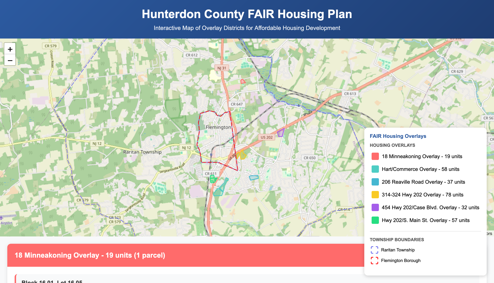

# Raritan Township - 2025 FAIR Housing Plan Map

An interactive, single-page web map designed to visualize and explain the 6 proposed affordable housing overlay districts in Raritan Township, NJ, as part of the 2025 Round 4 FAIR Housing Plan.

### [➡️ View the Live Interactive Map](https://sopat712.github.io/fair-housing-map/)


---

## Table of Contents
- [About The Project](#about-the-project)
- [The Problem](#the-problem)
- [The Solution](#the-solution)
- [Key Features](#key-features)
- [Technology Stack](#technology-stack)
- [Data Sources](#data-sources)
- [Local Development](#local-development)
- [Acknowledgments](#acknowledgments)
- [Contact](#contact)
- [License](#license)

---

## About The Project

This project was initiated in response to a need from the Raritan Township Democratic Committee (RTDC) to provide residents with a clear, accessible, and visual summary of the township's 2025 affordable housing plan.

In June 2025, I was presented with information regarding which properties were suitable for development to meet the state-mandated FAIR housing agreement of 299 units. While this information was available within a detailed planning document, there was no single, easy-to-understand resource that visualized the locations and potential impact for residents.

[I](http://joshpatra.me) created this tool to bridge that information gap. The map will be hopefully be published on the RTDC website and social media to foster transparency and community awareness.

## The Problem

A resource was required to answer these questions

*   Where are the proposed development sites?
*   How many total housing units are planned for each site?
*   Which specific land parcels (blocks and lots) are included?

## The Solution

This interactive map provides an intuitive, at-a-glance visualization of the complete plan. It plots the 6 overlay districts on a map of Raritan Township, allowing users to explore each site, view specific parcel details, and understand the total number of units associated with each overlay. The interface is designed to be user-friendly for a non-technical audience.

## Key Features

*   **Interactive Leaflet.js Map:** Fast and responsive map interface centered on Raritan Township.
*   **6 Highlighted Overlay Districts:** Each of the 6 proposed housing zones is clearly color-coded.
*   **Detailed Parcel Information:** Click on any highlighted parcel to see its Block, Lot, Address, and Owner information in a pop-up.
*   **Dynamic Legend:** The legend allows users to see the color key and click on an overlay name to automatically zoom to its location on the map.
*   **Collapsible Information Cards:** Below the map, detailed cards for each overlay list all included parcels and their specifics. A "View on Map" button instantly zooms to the selected parcel.
*   **Township Boundaries:** Includes outlines for both Raritan Township and Flemington Borough for better geographic context.
*   **Fully Responsive:** The layout is optimized for viewing on desktop, tablet, and mobile devices.

## Technology Stack

This is a self-contained, front-end only project built with standard web technologies:
*   **HTML5**
*   **CSS3** (with Flexbox for modern layouts)
*   **JavaScript (ES6+)**
*   **[Leaflet.js](https://leafletjs.com/)**: An open-source library for interactive maps.

*   Most likely, it will be integrated into a website as a single snippet, so it was necessary that it be one single code file, instead of splitting it into its disparate pieces

## Data Sources

The accuracy of this map is based on official planning documents and public data:
1.  **FAIR Share Plan Document:** The list of the 6 developable properties, including Block/Lot numbers, density, and unit counts, was sourced from the **June 2025 FAIR Housing Plan, pages 37-42**.
2.  **Parcel Geometry Data:** The geographic shapes (polygons) for each tax parcel were extracted from the **Hunterdon County Parcels shapefile**, available from the [Hunterdon County Open Data Portal](https://www.arcgis.com/home/item.html?id=d66b1a4ce7d046649f5189e8840a792d). This data was processed using GIS software (like QGIS) to export the relevant parcels into the GeoJSON format used by the application.
3.  **Municipal Boundaries:** The geographic boundaries for the relevant townships were extracted from the [Municipal Boundaries of NJ, Hosted, 3857](https://njogis-newjersey.opendata.arcgis.com/datasets/newjersey::municipal-boundaries-of-nj-hosted-3857/explore). This data was processed using GIS software (like QGIS) to export the relevant parcels into the GeoJSON format used by the application.

## Local Development

No complex build process is required to run this project locally.

1.  **Clone the repository:**
    ```sh
    git clone https://sopat712.github.io/fair-housing-map.git
    ```
    
2.  **Navigate to the directory:**
    ```sh
    cd fair-housing-map
    ```
    
3.  **Simply open the file:**
    You can open the `hunterdon_fair_housing_map.html` file directly in every modern browser!

## Contact
Josh Patra - [Portfolio](http://joshpatra.me)

## License
Distributed under the GPLv3 License. See `LICENSE` for more information.
